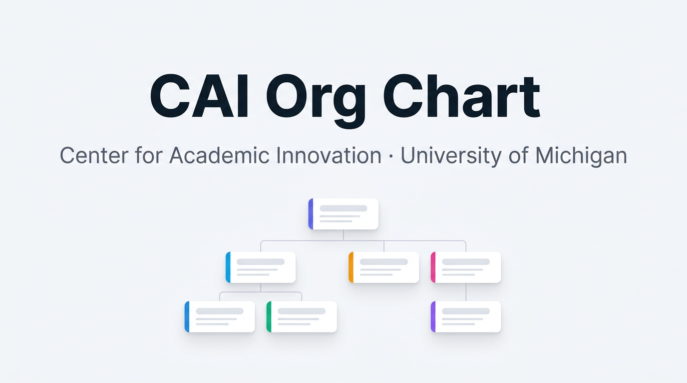

# CAI Org Chart

Interactive organizational chart for the **Center for Academic Innovation** at the University of Michigan.

🔗 **Live:** https://martynen-ops.github.io/cai-orgchart/



## Features

- **Interactive tree layout** — click any node to expand/collapse its team
- **Search** — keyboard shortcut `/` to focus search, arrow keys to navigate results
- **Pan & zoom** — drag to pan, scroll/pinch to zoom, plus zoom buttons
- **Minimap** — bottom-right overview with draggable viewport
- **Color-coded departments** — Executive, Learning, Technology, Operations, Marketing, Education Solutions
- **Tooltips on hover** — shows photo, title, department, and report count
- **Fully responsive** — works on desktop, tablet, and mobile
- **Accessible** — keyboard navigable, ARIA roles, WCAG AA contrast
- **Self-contained** — single HTML file, no build step, no server required

## How to update

The org chart data and staff images live inline in `index.html`:

- **`ORG_DATA`** — the organizational tree (names, titles, departments, reporting lines)
- **`STAFF_IMAGES`** — map of staff name to headshot URL (sourced from `ai.umich.edu`)

### Add or remove a person

Edit the `ORG_DATA` object in `index.html`. Each person looks like:

```js
{ name: "Jane Doe", title: "Director of Something", dept: "technology" }
```

Valid `dept` values: `executive`, `learning`, `technology`, `operations`, `marketing`, `solutions`.

Nodes with children use:

```js
{
  name: "Jane Doe", title: "Director of Something", dept: "technology",
  children: [
    { name: "Alex Smith", title: "Engineer", dept: "technology" }
  ]
}
```

Open vacancies use `name: "VACANCY"` and render with a distinct style.

### Add a headshot

Add an entry to `STAFF_IMAGES`:

```js
"Jane Doe": "https://ai.umich.edu/wp-content/uploads/YYYY/MM/filename.jpg",
```

Staff without an entry automatically get an initials avatar.

### Publish changes

```bash
git add index.html
git commit -m "Update org chart"
git push
```

GitHub Pages redeploys within ~1 minute.

## Local development

The file is fully self-contained — just open `index.html` in any browser:

```bash
open index.html
```

Or run a local server:

```bash
python3 -m http.server 8000
# then visit http://localhost:8000
```

## Analytics (optional)

Privacy-friendly visitor analytics via [GoatCounter](https://www.goatcounter.com/) are pre-wired but disabled by default. To enable:

1. Sign up for a free account at [goatcounter.com/signup](https://www.goatcounter.com/signup) and pick a code (e.g. `cai-orgchart`, giving you `cai-orgchart.goatcounter.com`)
2. In `index.html`, find the `<!-- GoatCounter -->` block and:
   - Replace `YOUR_CODE` with the code you picked
   - Remove the surrounding HTML comment markers
3. Commit and push

No cookies, no tracking, GDPR-compliant, and free for personal/non-commercial use.

## Tech stack

- [D3.js v7](https://d3js.org/) — tree layout and rendering
- Vanilla JS, HTML, and CSS — no build step
- [GitHub Pages](https://pages.github.com/) — hosting

## Credits

Built by **Marina Martynenko**, Director of Technology Infrastructure and Support at CAI.

Staff photos are sourced from the public [CAI team page](https://ai.umich.edu/who-are-we/our-team/).
